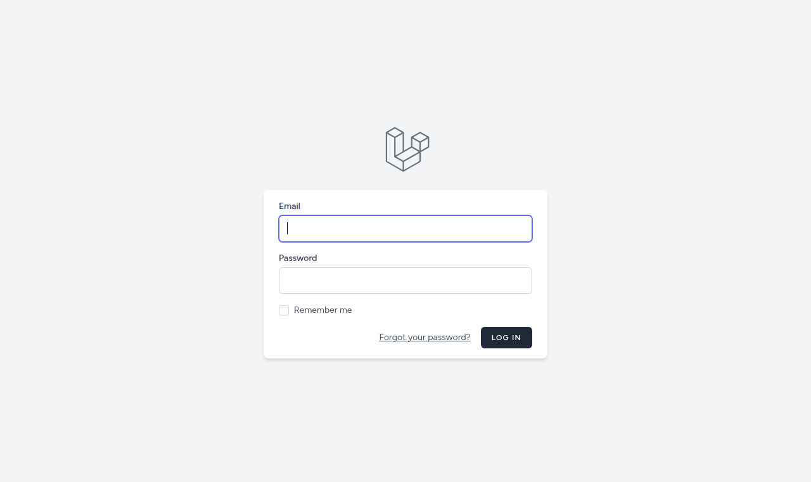
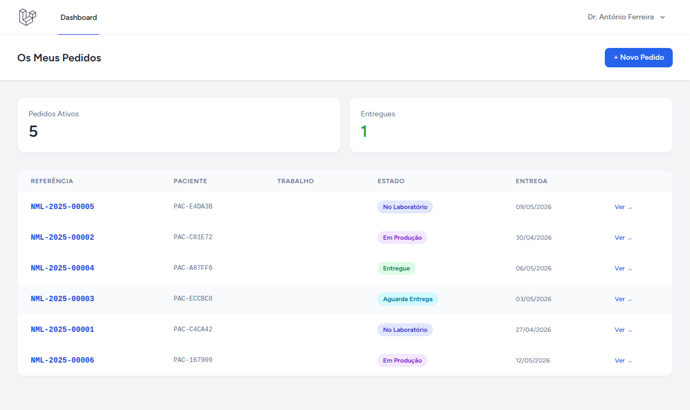
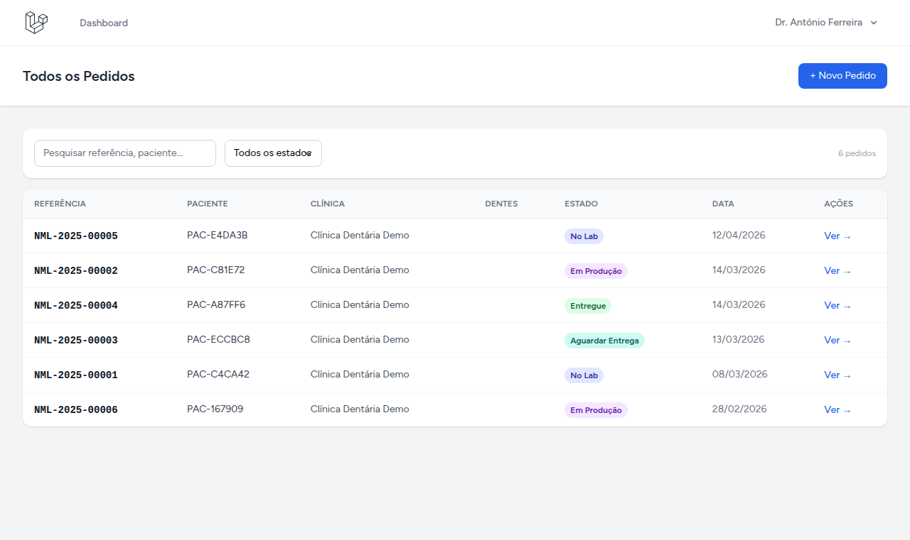
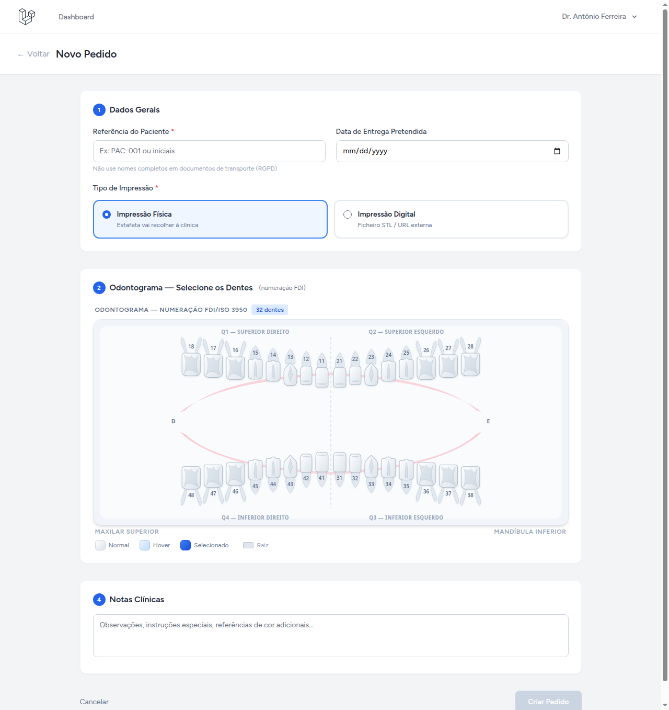
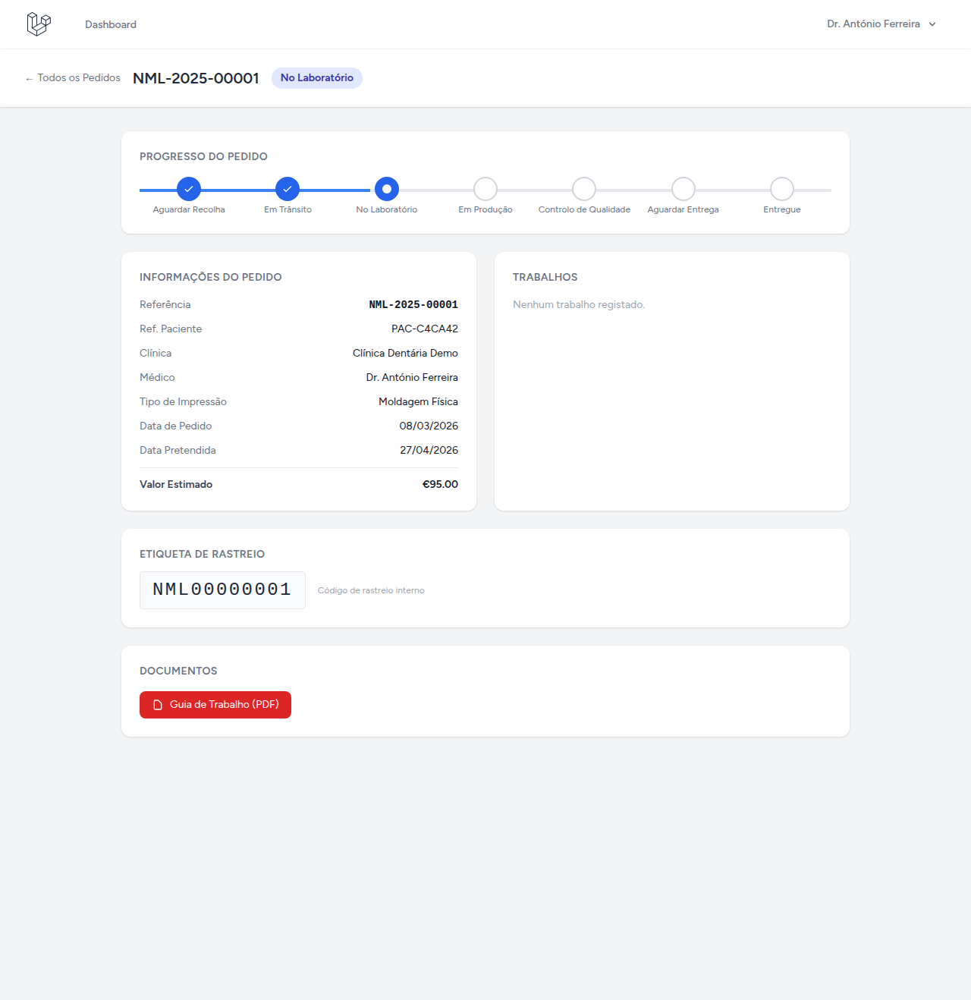
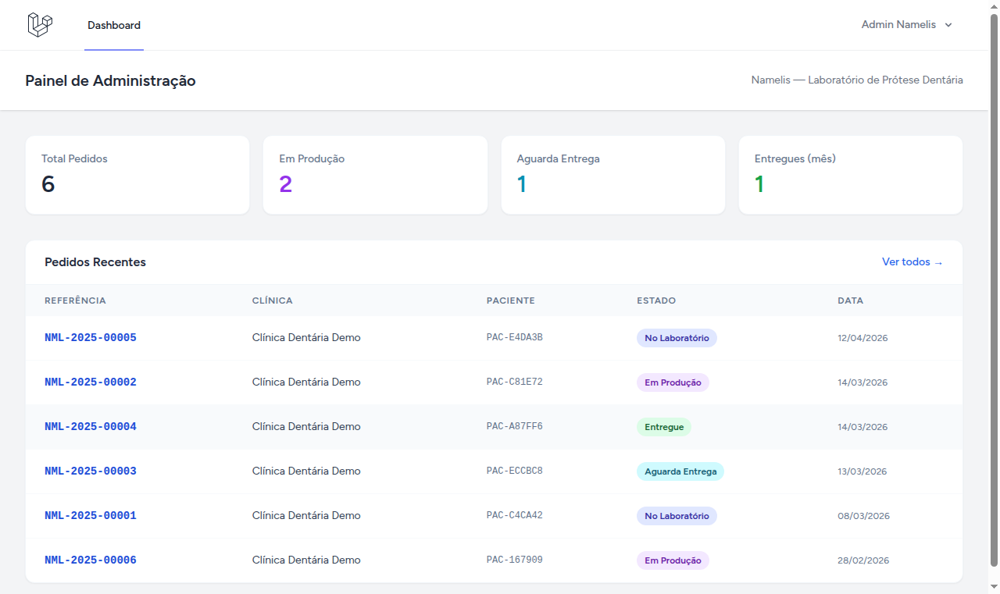

# Namelis Lab

Desenvolvi a base da aplicação — login, dashboards por perfil, cadastro de pedidos com odontograma e geração de PDF

O foco foi na lógica e nas funcionalidades, não no visual. O design dos dentes no odontograma, as interfaces em geral — tudo isso seria refinado durante o desenvolvimento real. O que está aqui é para mostrar que sei resolver o problema técnico, não o design final.

---

## O que está implementado

- Odontograma em SVG com norma FDI, detecção automática de pontes, seletor de tom VITA (A1–D4) e etapas de acabamento
- Fluxo de pedidos com 8 estados e timeline de transições registradas
- Dashboards por perfil: Dentista, Laboratório, Estafeta, Admin
- PDF com guia de trabalho + barcode Code128 gerado server-side
- View mobile do estafeta (recolhas e entregas)

---

| Login | Dashboard do Dentista |
|---|---|
|  |  |

| Lista de Pedidos | Criar Pedido — Odontograma |
|---|---|
|  |  |

| Detalhe do Pedido | Dashboard do Admin |
|---|---|
|  |  |

---

## Como está estruturado

```
app/
  Http/Controllers/
    OrderController.php      ← CRUD de pedidos + geração do PDF
    DashboardController.php  ← redireciona pro dashboard certo conforme o perfil
  Models/
    Order.php        ← referência automática NML-YYYY-NNNNN, soft deletes
    OrderItem.php    ← dente FDI, tom VITA, etapa de acabamento
    WorkCategory.php ← categorias em árvore de 3 níveis

resources/js/
  Pages/
    Orders/
      Create.vue   ← odontograma SVG interativo
      Show.vue     ← timeline do pedido + barcode
      Index.vue    ← lista com filtros
    Dashboard/
      Admin.vue    ← estatísticas e pedidos recentes
      Lab.vue      ← fila de produção
      Dentist.vue  ← pedidos da clínica
      Courier.vue  ← recolhas e entregas
  Components/
    Odontogram/
      OdontogramChart.vue  ← 32 dentes em SVG, gradientes, detecção de pontes

resources/views/pdf/
  order.blade.php  ← guia de trabalho A4 com barcode Code128
```

---

## Stack

Laravel 11 + Vue 3 com Inertia.js — a escolha principal é não separar backend e frontend em dois projetos distintos. Com Inertia, as props passam direto do controller pro componente Vue — menos camadas, menos pontos de falha, mais velocidade de entrega.

Pra os PDFs uso `barryvdh/laravel-dompdf` com `picqer/php-barcode-generator` pra gerar o Code128 em SVG inline. Funciona sem dependências externas no servidor.

Os perfis (admin, lab, dentist, courier) são gerenciados com Spatie Permission.

---

## O odontograma

Foi a parte mais trabalhosa. Cada dente é desenhado em SVG com curvas Bézier — coroa, raízes e cúspides. Quando se seleciona dentes consecutivos, a app detecta automaticamente se é uma ponte (pilares + pônticos).

A numeração segue a norma FDI (ISO 3950), que é o padrão usado pelos laboratórios.

---

## Fluxo de um pedido

`draft → awaiting_pickup → in_transit → at_lab → in_production → quality_check → awaiting_delivery → delivered`

Cada transição fica registrada numa timeline. O dentista consegue ver onde está o trabalho sem precisar ligar pro laboratório.

---

## Perfis de acesso

| Perfil | O que pode fazer |
|---|---|
| `admin` | Tudo |
| `lab` | Ver todos os pedidos, atualizar etapas |
| `dentist` | Criar pedidos, ver os da sua clínica |
| `courier` | Ver recolhas pendentes, marcar como entregue |

---

## Rodar localmente

```bash
git clone https://github.com/andryus/namelis-lab.git
cd namelis-lab

composer install
cp .env.example .env
php artisan key:generate

php artisan migrate --seed

npm install && npm run build
php artisan serve
```

Abrir em **http://127.0.0.1:8000**

Contas de demonstração (senha `demo1234`):

| Perfil | Email |
|---|---|
| Admin | `admin@namelis.pt` |
| Laboratório | `lab@namelis.pt` |
| Dentista | `dentista@clinica-demo.pt` |
| Entregador | `estafeta@namelis.pt` |

---

## O que falta pra produção

- Notificações por e-mail nas transições de estado
- PWA pro estafeta (hoje é só uma view responsiva) — funciona offline, instala no celular sem precisar de app na loja
- Faturação / SAF-T
- Relatórios e exportação de dados por período
- Multi-laboratório (hoje é tudo num único tenant)

---

## Requisitos

PHP 8.2+, Composer, Node 18+. Extensões PHP: `pdo_pgsql`, `mbstring`, `openssl`, `gd`.
